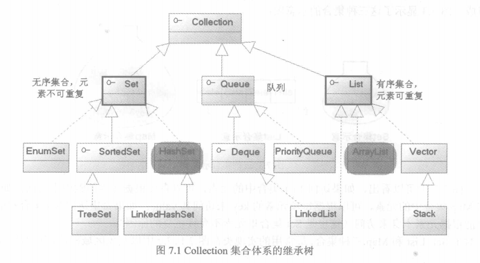
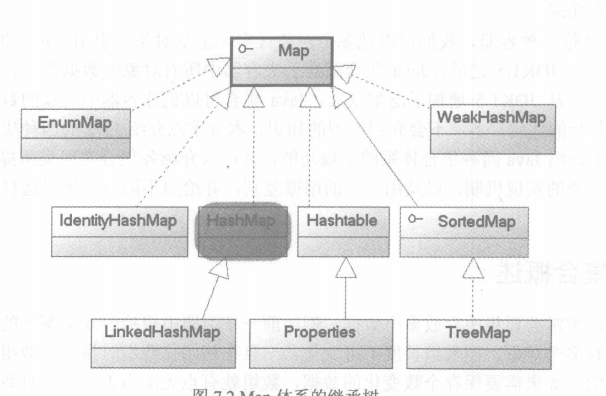
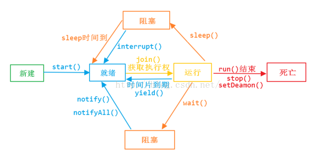

## JAVA知识要点

### 基础篇

- 面向对象的特征 
    ___抽象___：就是把现实世界中的某一类东西,提取出来,用程序代码表示,抽象出来的一般叫做类或者接口; 
    __数据抽象__->表示世界中一类事物的特征,就是对象的属性.比如鸟有翅膀,羽毛等(类的属性) 
    __过程抽象__->表示世界中一类事物的行为,就是对象的行为.比如鸟会飞,会叫(类的方法) 

    ___封装___：简单理解就是把过程和数据包围起来，对数据的访问只能通过特定的方式来 

    ___继承___：你爸把房子给你了，你想怎么改就怎么改，把你家厨房改厕所都可以 

    ___多态___：多态是指允许不同类的对象对同一消息做出响应.多态性包括参数化多态性和包含多态性 
    __动态链接__：对于父类中定义的方法,如果子类中重写了该方法,那么父类类型的引用将调用子类中的这个方法,这就是动态链接.
    ***
- final, finally, finalize 的区别 
    __final__：用于类，方法，变量前，用来表示该关键字修饰的类(不能被其他类继承)，方法(不能被覆盖，但是可以被重载)，变量(值就不能被修改)具有不可变的特性 
    __finally__：配合try语句使用，不管try块中的代码有没有抛出异常终止，finally语句块中的代码必然会执行 
    __finalize__：来源于Object中的方法,用于回收资源。finalize方法将在垃圾回收器清除对象之前调用,可以用于某些对象的回收监控，但是不要依赖使用该方法回收任何短缺的资源，这是因为很难知道这个方法什么时候被调用，完全看GC心情
    ***
- int 和 Integer 有什么区别 
    __int__是JAVA原始类型，Integer是JAVA对原始类型的一种包装类型。可以这么看，当初JAVA认为万事万物兼对象，JAVA5之后将这些基本数据类型当成对象操作。
    ***
- 重载和重写的区别 
    你有从你爸那里继承来一套别墅，别墅以前你爸规定只住你们一家人，但是现在你拿到了，至于里面住人、住狗或者其他随你便，这就叫 __重载__ ; 
    突然有一天，你觉得别墅大门太少了，所以你又凿出了几个门；或者你脑袋抽风，说干脆把门堵了不让人出去了。或者你干脆把房子炸了，你在原地再造一个。但是地名还是那块地名，你没法变。这些就是 __重写__
    ***

- 抽象类和接口有什么区别 
    ___相同的___：都是上层的抽象层；不能被实例化；包含抽象的方法但不比提供具体的实现 
    ___区别的___：抽象类中可以写非抽象的方法;类只能单继承extends，接口可以多实现implements
    ***
- 说说反射的用途及实现 
    ___JAVA反射___ 机制是在运行状态中，对于任意一个类，都能够知道这个类的所有属性和方法；对于任意一个对象，都能够调用它的任意一个方法；这种动态获取的信息以及动态调用对象的方法的功能称为java语言的反射机制; 
    功能： 在运行时判断任意一个对象所属的类；在运行时构造任意一个类的对象；在运行时判断任意一个类所具有的成员变量和方法；在运行时调用任意一个对象的方法；生成动态代理
    ***
- 说说自定义注解的场景及实现 
   记住几个元注解：@Retention、@Target、@Inherited、@Documented）
    要真将这个注解，使用场景和实现太多了,例如：数据库表关系映射ORM、Android中一些框架提供的用注解来简化findViewById写法，等等。网上很多博客可以看看,可以看看这个[自定义注解示例，利用反射进行解析](http://www.importnew.com/14479.html)
    ***
- HTTP 请求的 GET 与 POST 方式的区别 
    GET的语义是请求获取指定的资源。GET方法是安全、幂等、可缓存的（除非有 Cache-ControlHeader的约束）,GET方法的报文主体没有任何语义。POST的语义是根据请求负荷（报文主体）对指定的资源做出处理，具体的处理方式视资源类型而不同。POST不安全，不幂等，（大部分实现）不可缓存。为了针对其不可缓存性，有一系列的方法来进行优化，以后有机会再研究（FLAG已经立起）。
    [但是这里有干货](http://mp.weixin.qq.com/s?__biz=MzI3NzIzMzg3Mw==&mid=100000054&idx=1&sn=71f6c214f3833d9ca20b9f7dcd9d33e4#rd)
    ***
- session 与 cookie 区别 
    ___Session___ 是在服务端保存的一个数据结构，用来跟踪用户的状态，这个数据可以保存在集群、数据库、文件中； 
    ___Cookie___ 是客户端保存用户信息的一种机制，用来记录用户的一些信息，也是实现Session的一种方式。
    ***
- session 分布式处理 
    [分布式Session的一致性问题](https://www.cnblogs.com/study-everyday/p/7853145.html)
    ***
- JDBC 流程 
    1、加载JDBC驱动程序 
    2、提供JDBC连接的URL 
    3、创建数据库的连接  
    4、创建一个Statement 
    5、执行SQL语句 
    6、处理返回结果 
    ***
- MVC 设计思想 
    经典课题:Model View Controller（ 模型-视图-控制器）设计创建 Web 应用程序的模式
    ***
- equals 与 == 的区别 
    Java 语言里的 equals方法其实是交给开发者去覆写的，让开发者自己去定义满足什么条件的两个Object是equal的。“==”操作符单存比较两个对象在JVM虚拟机中分配的地址 。
    ***

### 集合

- List 和 Set 区别 
    __List,Set__ 都是继承自 __Collection__ 接口 
    __List特点__：元素有放入顺序，元素可重复 ;__Set特点__：元素无放入顺序，元素不可重复(注意：元素虽然无放入顺序，但是元素在set中的位置是有该元素的HashCode决定的，其位置其实是固定的) 
    __List__ 接口有三个实现类：__LinkedList，ArrayList，Vector__; 
    __Set__ 接口有两个实现类：__HashSet__(底层由HashMap实现)，__LinkedHashSet__
    ***
- List 和 Map 区别 
    ___List___ 是对象集合，允许对象重复
    ___Map___ 是键值对的集合，不允许key 
    ***
- Arraylist 与 LinkedList 区别 
    [干货在这里](http://blog.csdn.net/eson_15/article/details/51145788)
    绝对不会让你失望的，对于添加或删除，___LinkedList和ArrayList___ 并不能明确说明谁快谁慢
    ***
- ArrayList 与 Vector 区别 
    1、Vector是线程安全的，ArrayList不是线程安全的。 
    2、ArrayList在底层数组不够用时在原来的基础上扩展0.5倍，Vector是扩展1倍。 
    [ArrayList 与 Vector 区别](https://zhuanlan.zhihu.com/p/28241176)
    ***
- HashMap 和 Hashtable 的区别 
    [HashMap 和 Hashtable 的区别](http://www.importnew.com/24822.html)
    ***
- HashSet 和 HashMap 区别 
    [HashSet 和 HashMap 区别](http://www.importnew.com/6931.html)
    ***
- HashMap 和 ConcurrentHashMap 的区别 
    主要区别线程安全的区别 
    [谈谈HashMap线程不安全的体现](https://my.oschina.net/hosee/blog/673521)
    [Java中的几个HashMap/ConcurrentHashMap实现分析](http://www.importnew.com/19685.html)
    ***
- ConcurrentHashMap 的工作原理及代码实现 
    [ConcurrentHashMap总结](http://www.importnew.com/22007.html)
    ***

### 线程
- 创建线程的方式及实现 
    1）继承Thread类创建线程 
    2）实现Runnable接口创建线程 
    3）使用Callable和Future创建线程 
    ***
- sleep() 、join（）、yield（）有什么区别 
    1、___sleep()___ 方法 
    在指定的毫秒数内让当前正在执行的线程休眠（暂停执行），此操作受到系统计时器和调度程序精度和准确性的影响。 让其他线程有机会继续执行，但它并不释放对象锁。也就是如果有Synchronized同步块，其他线程仍然不同访问共享数据。注意该方法要捕获异常 
    比如有两个线程同时执行(没有Synchronized)，一个线程优先级为MAX_PRIORITY，另一个为MIN_PRIORITY，如果没有Sleep()方法，只有高优先级的线程执行完成后，低优先级的线程才能执行；但当高优先级的线程sleep(5000)后，低优先级就有机会执行了。
    总之，sleep()可以使低优先级的线程得到执行的机会，当然也可以让同优先级、高优先级的线程有执行的机会。 
    2、___yield()___ 方法 
    暂停当前正在执行的线程对象，并执行其他线程。
    yield()应该做的是让当前运行线程回到可运行状态，以允许具有相同优先级的其他线程获得运行机会。但是，实际中无法保证yield()达到让步目的，因为让步的线程还有可能被线程调度程序再次选中。
    yield()从未导致线程转到等待/睡眠/阻塞状态。在大多数情况下，yield()将导致线程从运行状态转到可运行状态，但有可能没有效果。 
    3、___join()___ 方法 
    Thread的非静态方法join()让一个线程B“加入”到另外一个线程A的尾部。在A执行完毕之前，B不能工作。
        Thread t = new MyThread();
        t.start();
        t.join();
    保证当前线程停止执行，直到该线程所加入的线程完成为止。然而，如果它加入的线程没有存活，则当前线程不需要停止。
    ***
- [说说 CountDownLatch / CyclicBarrier / Semaphore原理](http://www.importnew.com/21889.html)
- [说说 Exchanger 原理](http://blog.csdn.net/luoyuyou/article/details/30257073)
- 说说 CountDownLatch 与 CyclicBarrier 区别
    <table>
        <tr>
            <td>CountDownLatch</td>
            <td>CyclicBarrier</td>
        </tr>
        <tr>
            <td>减计数方式</td>
            <td>加计数方式</td>
        </tr>
        <tr>
            <td>计算为0时释放所有等待的线程</td>
            <td>计数达到指定值时释放所有等待线程</td>
        </tr>
        <tr>
            <td>计数为0时，无法重置</td>
            <td>计数达到指定值时，计数置为0重新开始</td>
        </tr>
        <tr>
            <td>调用countDown()方法计数减一，调用await()方法只进行阻塞，对计数没任何影响</td>
            <td>调用await()方法计数加1，若加1后的值不等于构造方法的值，则线程阻塞</td>
        </tr>
        <tr>
            <td>不可重复利用</td>
            <td>可重复利用</td>
        </tr>
    </table>
    
    ***
- [ThreadLocal 原理分析](http://www.importnew.com/20963.html)
- [讲讲线程池的实现原理](http://www.cnblogs.com/dolphin0520/p/3932921.html)
- 线程池的几种方式
    具体实现来看，它们实际上也是调用了 __ThreadPoolExecutor__ ，只不过参数都已配置好了。 
    __newFixedThreadPool__ 创建的线程池corePoolSize和maximumPoolSize值是相等的，它使用的LinkedBlockingQueue； 
    __newSingleThreadExecutor__ 将corePoolSize和maximumPoolSize都设置为1，也使用的LinkedBlockingQueue； 
    __newCachedThreadPool__ 将corePoolSize设置为0，将maximumPoolSize设置为Integer.MAX_VALUE，使用的SynchronousQueue，也就是说来了任务就创建线程运行，当线程空闲超过60秒，就销毁线程。 
　　 实际中，如果Executors提供的三个静态方法能满足要求，就尽量使用它提供的三个方法，因为自己去手动配置ThreadPoolExecutor的参数有点麻烦，要根据实际任务的类型和数量来进行配置。
    ***

- 线程的生命周期
    
    ***

### 锁机制
- [说说线程安全问题](https://www.cnblogs.com/xumanbu/p/4203504.html)
- [volatile 实现原理](http://www.importnew.com/24082.html)
- [synchronize 实现原理](http://www.importnew.com/23511.html)
- [synchronized 与 lock 的区别](http://blog.csdn.net/u012403290/article/details/64910926)
- [CAS 乐观锁](http://www.hollischuang.com/archives/1537)
- ABA 问题
[Java CAS 和ABA问题](https://www.cnblogs.com/549294286/p/3766717.html)
- 乐观锁的业务场景及实现方式

